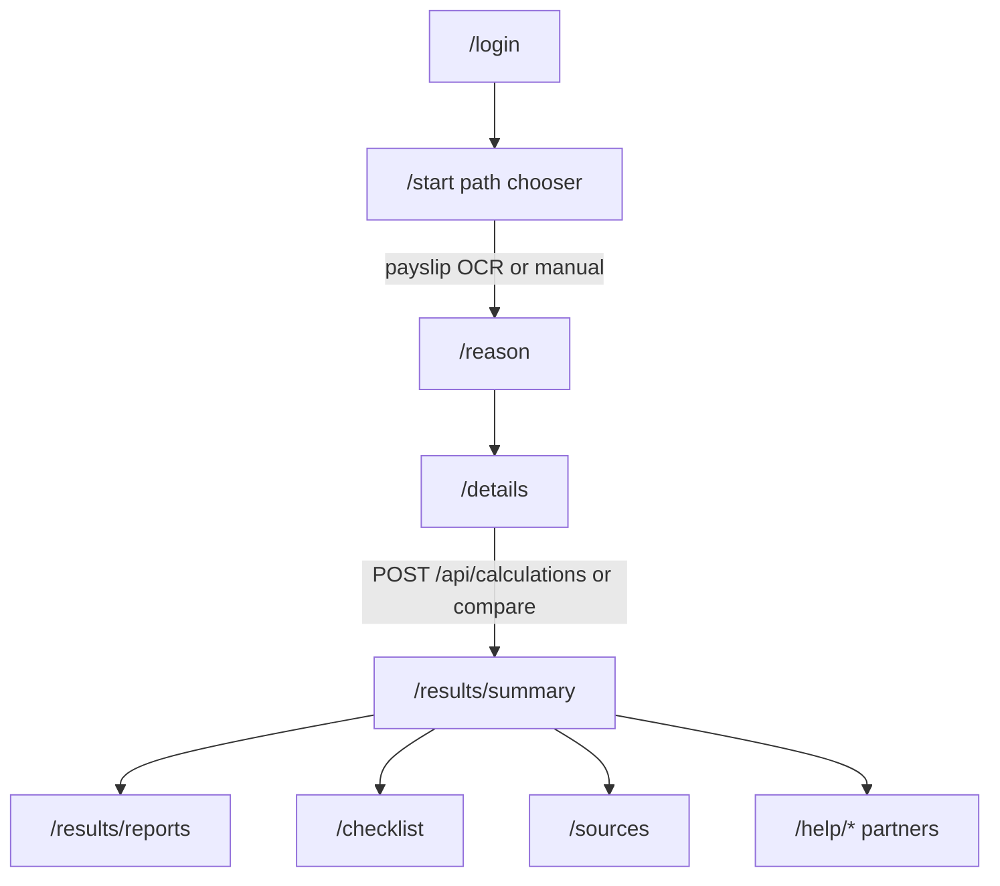
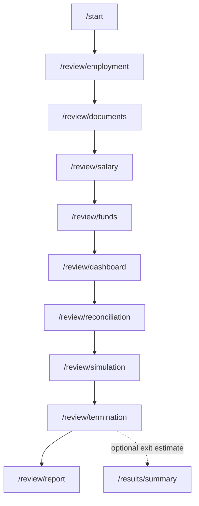

# User flow & calculation guide

Product: **יוצאים בראש שקט** — Hebrew employment exit-rights estimate and multi-year employment / pension review.

> Estimates only — not legal advice. Annual legal values in Postgres must be verified before relying on production numbers.

Related docs:

- [Authentication setup](./authentication-setup.md)
- Root [README.md](../README.md)
- Client [README.md](../client/README.md)

---

## 1. What the product does

Two separate paths after login / guest:

| Path | Hebrew CTA | Purpose | Engine |
|------|------------|---------|--------|
| **Quick estimate** | הערכה מהירה | Severance, notice, vacation redemption, recuperation for leaving a job | `RightsCalculator` + policies |
| **Employment review** | בדיקת תקופת העסקה | Expected vs reported vs actual deposits over years, health score, simulation | `ReconciliationEngine` + `ContributionRulesEngine` + `SimulationEngine` |

The **browser never calculates rights**. All money math runs on the .NET API.

---

## 2. User flows

### 2.1 Guest vs signed-in

| | Guest | Signed-in |
|---|--------|-----------|
| Entry | Login → «להמשיך בלי חשבון» | Google / Apple / Microsoft / email OTP |
| Session | `localStorage` `rs-guest=1` | Bearer tokens in `rs-auth` |
| Calculator | Fully usable | Same |
| Payslip images after OCR | Not kept | May be saved on workspace (authenticated) |
| Cloud workspaces | Local only | Sync when signed in |
| Guard | `sessionGuard` allows guest **or** signed-in | Same |

Key files: [`client/src/app/core/auth/auth.service.ts`](../client/src/app/core/auth/auth.service.ts), [`auth.guards.ts`](../client/src/app/core/auth/auth.guards.ts).

### 2.2 End-to-end diagrams

#### Quick estimate

#### Employment review

### 2.3 Screens (route → page → what the user does)

| Route | Page | User action | Next |
|-------|------|-------------|------|
| `/login` | `login.page.ts` | Social / email OTP / guest | Guest → `/start`; new sign-in → `/details`; returning → `/resume` |
| `/landing` | `landing.page.ts` | Marketing | `/start` |
| `/resume` | `resume.page.ts` | Continue workspace or start fresh | Saved route or `/start` |
| `/start` | `welcome.page.ts` | Choose path; upload payslip(s) or go manual | Quick → `/reason`; Review → `/review/employment` |
| `/reason` | `reason.page.ts` | Exit reason | `/details` |
| `/details` | `details.page.ts` | Confirm / fill profile | `/results/summary` |
| `/results/summary` | `summary.page.ts` | See components + totals | Reports / checklist / sources / help |
| `/results/reports` | `reports.page.ts` | Build / export report | — |
| `/checklist` | `checklist.page.ts` | Reason-filtered checklist | — |
| `/sources` | `sources.page.ts` | Official links (Mongo) | — |
| `/help/...` | `partners.page.ts`, `partner-contact.page.ts` | Paid help request | POST `/api/help-requests` |
| `/review/employment` | `review-employment.page.ts` | Employer, dates, structure flags | `/review/documents` |
| `/review/documents` | `review-documents.page.ts` | Document checklist meta | `/review/salary` |
| `/review/salary` | `review-salary.page.ts` | Salary segments over time | `/review/funds` |
| `/review/funds` | `review-funds.page.ts` | Pension / study / etc. accounts | `/review/dashboard` |
| `/review/dashboard` | `review-dashboard.page.ts` | Health score overview | nav |
| `/review/reconciliation` | `review-reconciliation.page.ts` | Month / source matrix | nav |
| `/review/simulation` | `review-simulation.page.ts` | Accumulation scenarios | nav |
| `/review/termination` | `review-termination.page.ts` | Gaps + optional exit estimate | `/review/report` |
| `/review/report` | `review-report.page.ts` | HTML / CSV / JSON export | — |

Routes: [`client/src/app/app.routes.ts`](../client/src/app/app.routes.ts).

---

## 3. How the quick calculation works

### 3.1 Required inputs (`ProfileDto`)

Client model: [`client/src/app/core/models.ts`](../client/src/app/core/models.ts)  
Server validation: [`EmploymentProfile`](../server/src/RoshShaket.Domain/EmploymentProfile.cs)

| Field | Required for calc | Meaning |
|-------|-------------------|---------|
| `startDate` | **Yes** | Employment start (`yyyy-MM-dd`) |
| `endDate` | Yes (defaults / set by UI) | Exit or planned end; must be after start |
| `monthlySalary` | **Yes** (> 0) | Last / typical monthly gross |
| `jobPercent` | Yes (1–100) | Part-time fraction for recuperation |
| `workDaysPerWeek` | Yes (1–6) | Week length → daily wage |
| `vacationBalanceDays` | Yes (≥ 0) | Unused vacation days |
| `recuperationDaysPaidLastYear` | Yes (≥ 0) | Recuperation already paid |
| `section14` | Yes | `Full` \| `Partial6` \| `None` \| `Unknown` |
| `hasStudyFund` | Optional | Affects funds advisory text |
| `payType` | Server default Monthly | Hourly only adds an advisory |

UI gate (`wizard.store`): calculation enabled when **start date** and **monthly salary > 0** are present.

Also sent to the API:

- `reason` — exit reason (or compare mode)
- `fromPayslip` — whether values came from OCR
- `funds[]` — optional fund lines for the **report** (not added into `estimatedTotal`)

### 3.2 API call sequence

| Step | Client | Server |
|------|--------|--------|
| Optional OCR | `POST /api/payslips/extract` (multipart, ≤5 files) | Claude extractor → `ProfileDraft` |
| Single reason | `POST /api/calculations` | `CalculateRightsHandler` → `RightsCalculator` |
| «עוד שוקל» | `POST /api/calculations/compare` | Fired **and** Resigned scenarios |
| Report | `POST /api/reports` / `export` | `BuildReportHandler` |
| Checklist / sources | `GET /api/checklist`, `/api/sources` | Mongo (cached via Redis) |

Facade: [`client/src/app/core/calculation.facade.ts`](../client/src/app/core/calculation.facade.ts)  
API: [`client/src/app/core/api.service.ts`](../client/src/app/core/api.service.ts)  
Endpoints: [`server/.../CalculationEndpoints.cs`](../server/src/RoshShaket.Api/Endpoints/CalculationEndpoints.cs)

### 3.3 Annual values (Postgres)

Loaded for the **end date** of employment:

- Table `annual_values` (`RightsDbContext`)
- Fields used in rules today: `RecuperationDayValue`, `FullSeveranceRatePercent` (8.33%)
- Also stored: `SeveranceTaxExemptCapPerYear` (not applied in severance math yet)

Provider: `PostgresAnnualValuesProvider` (cached).

### 3.4 Rules run by `RightsCalculator`

Registration order in [`ApplicationModule.cs`](../server/src/RoshShaket.Api/Composition/ApplicationModule.cs):

| Order | Rule | Code | In `estimatedTotal`? | What it computes |
|------:|------|------|----------------------|------------------|
| 10 | `SeveranceRule` | `severance` | Employer top-up only | Severance / Section 14 |
| 20 | `NoticePeriodRule` | `notice` | **Never** | Notice days / in-lieu amount |
| 30 | `VacationRedemptionRule` | `vacation` | Yes | Balance × daily wage |
| 40 | `RecuperationRule` | `recuperation` | Yes if entitled | Days by seniority − paid |
| 50 | `PensionFundsRule` | `funds` | **No** | «לבדוק במסלקה» — advisory |

Policies (pure formulas): [`Policies.cs`](../server/src/RoshShaket.Domain/Policies/Policies.cs).

`estimatedTotal` = sum of components where `IncludedInTotal && Amount`.

### 3.5 Effect of exit reason

| Reason (UI) | Enum | Severance entitlement | Notice |
|-------------|------|----------------------|--------|
| פיטורים | `Fired` | Yes if ≥ 1 year | Employer pays in-lieu (needs verification) |
| התפטרות בדין מפוטר | `ResignedJustified` | Same as Fired | Employee must give notice |
| סיום חוזה | `ContractEnded` | Same as Fired | Like Fired |
| התפטרות | `Resigned` | No employer severance; Section 14 may show «בקופה» | Employee gives notice |
| עוד שוקל | `Considering` | Client runs **compare**: Fired vs Resigned | Both scenarios |

**Section 14** (when severance entitled):

| Arrangement | Behavior |
|-------------|----------|
| `Unknown` | Range / NeedsVerification |
| `Full` | No employer top-up in total; text points to Form 161 release from fund |
| `Partial6` | Employer pays share of `(8.33% − 6%) / 8.33%` |
| `None` | Full `salary × years` employer top-up |

---

## 4. Documents needed for a full calculation

### 4.1 Quick path — minimum vs better accuracy

| Document | Needed? | What it unlocks in the product |
|----------|---------|--------------------------------|
| **Last payslip** (1–5 images/PDF) | Best starting point | OCR fills salary, dates, %, vacation, recuperation, Section 14 hint, study fund, fund lines |
| **Manual entry** | Alternative | Same fields without OCR |
| **Employment contract** | Recommended for accuracy | Confirm Section 14 arrangement (engine does not parse the PDF) |
| **Accurate vacation / recuperation balances** | Recommended | From HR / last slip; wrong balances → wrong vacation/recuperation lines |
| **Form 161** | Mentioned in copy when Section 14 Full | Not uploaded/parsed; user acts outside the app |
| **Form 101** | Not used by engine | UI metaphor only |
| **Pension clearing report (מסלקה)** | Not in money total | Quick path only **advises** to check clearing; does not parse it |
| **Multi-year payslips** | Not required for quick estimate | Product says last slip is enough for exit estimate |

**Minimum for a number:** start date + monthly salary + end date + reason (+ defaults for other fields).

**Better exit estimate:** last payslip **or** verified manual fields + correct Section 14 from contract + correct vacation/recuperation.

**Fund deposit truth (who paid what each month):** use the **employment review** path + pension / study reports — not `RightsCalculator.estimatedTotal`.

### 4.2 Employment review — document checklist

Defined in [`review.models.ts` → `DOC_CHECKLIST`](../client/src/app/core/review.models.ts):

| Key | Label (Hebrew) | Role |
|-----|----------------|------|
| `payslip` | תלושי שכר | Reported amounts / months |
| `form106` | טופסי 106 | Annual employer reporting |
| `pension_report` | דוח הפקדות פנסיה | Actual pension deposits |
| `study_report` | דוח קרן השתלמות | Study fund deposits |
| `managers_report` | ביטוח מנהלים | Managers insurance |
| `balance_report` | יתרות עדכני | Current balances |
| `fees` | דמי ניהול | Simulation assumptions |
| `returns` | תשואות | Simulation assumptions |
| `termination` | מסמכי סיום | Exit paperwork |

On this path the UI stores **document metadata** (type, period, parsed flags). Full multi-document OCR for every type is not assumed — users mark what they have; analysis uses salary segments, expected rates, and reported/actual month data (including demo dataset).

### 4.3 Suggested “full picture” pack for a user

For **leaving this month (quick path):**

1. Last payslip (or last 2–3 if variable pay)
2. Employment contract / Section 14 confirmation
3. Vacation & recuperation balance confirmation from employer
4. Optional: Form 161 instructions when Section 14 Full

For **checking years of deposits (review path):**

1. Payslips spanning the period (or salary history)
2. Pension deposit report / מסלקה extract
3. Study fund report (if relevant)
4. Forms 106 for relevant years
5. Current balance statements
6. Termination docs if already ended

---

## 5. Employment review engines (separate from exit calc)

| Piece | Location | Role |
|-------|----------|------|
| Client store | `client/src/app/core/review.store.ts` | Local + optional API sync |
| Expected rates | `ContributionRulesEngine` + `StaticContributionRuleProvider` | Dev estimate rates (`isEstimate: true`) |
| Gaps / matrix | `ReconciliationEngine` | Expected / Reported / Actual, anomalies, health |
| Projection | `SimulationEngine` | Accumulation scenarios |
| Report | `ReconciliationReportBuilder` | HTML/CSV/JSON |
| API | `EmploymentReviewEndpoints.cs` | `/api/employment-review/*` |
| Demo data | `DemoEmploymentDataset` | Multi-year sample with intentional gaps |

Optional bridge: `/review/termination` can push profile into the wizard store and run the **quick** `RightsCalculator` for an exit estimate.

---

## 6. Key source files

### Client

| Area | Path |
|------|------|
| Routes | `client/src/app/app.routes.ts` |
| Profile / results models | `client/src/app/core/models.ts` |
| Wizard state | `client/src/app/core/wizard.store.ts` |
| Calc orchestration | `client/src/app/core/calculation.facade.ts` |
| HTTP | `client/src/app/core/api.service.ts` |
| Review models / checklist | `client/src/app/core/review.models.ts` |
| Review state | `client/src/app/core/review.store.ts` |
| Payslip capture | `client/src/app/pages/welcome.page.ts`, `core/photo.service.ts` |

### Server

| Area | Path |
|------|------|
| Calculator | `server/src/RoshShaket.Application/Calculation/RightsCalculator.cs` |
| Rules | `server/src/RoshShaket.Application/Rules/*.cs` |
| Policies | `server/src/RoshShaket.Domain/Policies/Policies.cs` |
| Profile | `server/src/RoshShaket.Domain/EmploymentProfile.cs` |
| Use cases | `server/src/RoshShaket.Application/UseCases/UseCases.cs` |
| Payslip OCR | `server/src/RoshShaket.Infrastructure/Claude/ClaudePayslipExtractor.cs` |
| Annual values | `RightsDbContext` + `PostgresAnnualValuesProvider` |
| Reconciliation | `Application/Reconciliation/ReconciliationEngine.cs` |
| Contribution rules | `Application/Rules/Contribution/*` |
| Simulation | `Application/Simulation/SimulationEngine.cs` |

---

## 7. Honesty limits (what “full calculation” cannot mean today)

1. **`estimatedTotal` excludes** notice in-lieu and pension fund balances.
2. **מסלקה / clearing** is advised, not auto-imported in the quick path.
3. **Contribution rates** in the review engine are **dev estimates**, not live מסלקה.
4. **Tax exempt severance cap** is stored in Postgres but not applied in the severance rule yet.
5. Results are an **estimate** for monthly employees; hourly pay only adds an advisory.

---

## 8. Quick reference — “What do I need?”

| Goal | Bring these | Path |
|------|-------------|------|
| Fast “how much might I get leaving?” | Last payslip **or** salary + start/end dates + reason | `/start` → הערכה מהירה |
| More accurate exit money lines | + contract (Section 14) + vacation/recuperation balances | Same + careful `/details` |
| Were deposits made every month? | Payslips / 106 / pension & study reports over the period | `/start` → בדיקת תקופת העסקה |
| Legal certainty | Lawyer + primary sources from `/sources` | Help partners `/help/*` |
